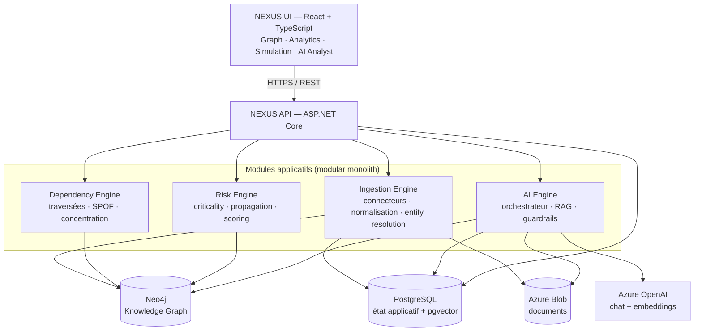
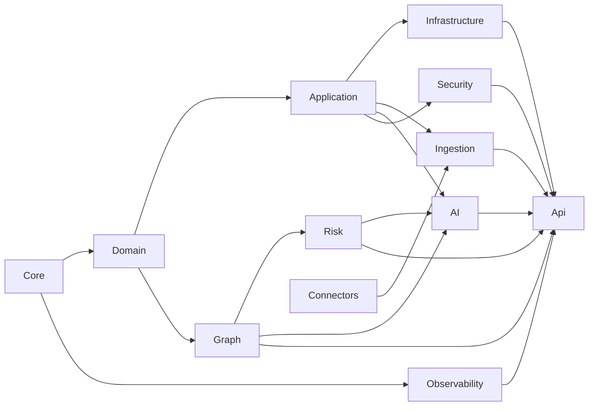
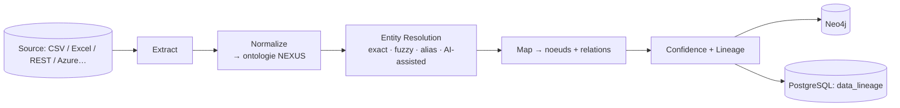

# NEXUS — Architecture

Version : 1.0 (Phase 0) · Statut : Foundation

Ce document décrit l'architecture cible de NEXUS et les choix structurants. Il est complété par les [ADR](adr/) pour les décisions individuelles.

---

## 1. Vision architecturale

NEXUS est une **couche d'intelligence** au-dessus des systèmes existants d'une organisation. Il **lit, normalise, corrèle, analyse, calcule, simule et recommande** — sans jamais modifier les systèmes sources (article 3, *read-only first*).

Trois qualités dirigent chaque décision :

1. **Explicabilité** — le déterministe (graphe + règles) prime ; l'IA est une surcouche qui explique et enrichit.
2. **Traçabilité** — toute donnée porte son lineage ; toute relation porte sa confiance et sa preuve.
3. **Défendabilité (IP / moat)** — l'ontologie, la résolution d'entités, le moteur de dépendances/propagation et les connecteurs constituent la valeur difficile à reproduire (articles 59-62).

---

## 2. Vue composants



---

## 3. Séparation des données : deux bases, deux rôles

| | PostgreSQL | Neo4j |
|---|---|---|
| **Rôle** | Plan de contrôle / état applicatif | Plan opérationnel / modèle de dépendances |
| **Contenu** | tenants, users, RBAC, connecteurs, jobs, audit, documents+embeddings, config risque | assets, entités d'ontologie, relations, topologie |
| **Pourquoi** | intégrité relationnelle, transactions, pgvector | traversées multi-sauts, chemins, propagation, algos GDS |

Voir [ADR-0002](adr/ADR-0002-neo4j-for-graph.md) et [ADR-0004](adr/ADR-0004-pgvector-over-dedicated-vector-db.md).

---

## 4. Architecture logique (modular monolith)

Un **monolithe modulaire** propre, pas de microservices prématurés (article 6). Chaque module est un projet .NET avec une frontière claire ; l'extraction en service indépendant se fait plus tard, guidée par les besoins réels de scalabilité.

Dépendances autorisées (flèche = « référence ») :



| Module | Responsabilité | Dépend de |
|---|---|---|
| `Nexus.Core` | Shared kernel : `Result<T>`, erreurs, primitives, abstractions transverses | — |
| `Nexus.Domain` | Ontologie, entités, value objects, invariants métier **purs** (aucune dépendance infra) | Core |
| `Nexus.Application` | Cas d'usage (CQRS), ports/interfaces, orchestration applicative | Domain, Core |
| `Nexus.Infrastructure` | EF Core, repositories PostgreSQL, migrations, storage | Application, Domain, Core |
| `Nexus.Graph` | Client Neo4j, traversées, dependency engine, SPOF/concentration | Domain, Core |
| `Nexus.Risk` | Criticality, Risk scoring (configurable), Propagation | Domain, Core, Graph |
| `Nexus.Ingestion` | Pipeline : extract → normalize → resolve → map → sync ; lineage | Application, Domain, Core, Connectors |
| `Nexus.Connectors` | Framework `IConnector` + implémentations (CSV, Excel, REST…) | Domain, Core |
| `Nexus.AI` | Orchestrateur, intent detection, RAG, context builder, guardrails | Domain, Core, Graph, Risk, Application |
| `Nexus.Security` | Auth OIDC/Entra, RBAC, isolation tenant, autorisation | Core, Application |
| `Nexus.Observability` | OpenTelemetry, Serilog, métriques | Core |
| `Nexus.Api` | Composition root, contrôleurs REST, OpenAPI, middleware | tous les modules ci-dessus |
| `Nexus.Seed` | Génération du dataset de démonstration | Infrastructure, Application, Graph |

**Règle de dépendance** : le Domaine ne dépend de rien d'externe. Les dépendances pointent vers l'intérieur (clean architecture). Aucun module métier ne référence directement un connecteur ou un fournisseur cloud (article 10).

---

## 5. Pipeline de valeur (article 79)

```text
DATA → KNOWLEDGE GRAPH → DEPENDENCIES → RISK → SIMULATION → BUSINESS IMPACT → RECOMMENDATION
```

1. **Ingestion** : les connecteurs lisent les sources (read-only), normalisent vers l'ontologie NEXUS, résolvent les entités, écrivent le graphe avec lineage + confidence.
2. **Dependency Engine** : parcourt le graphe (dépendances directes/indirectes, cycles, SPOF, concentration).
3. **Risk Engine** : calcule un `RiskScore` 0–100 **explicable et configurable** par tenant.
4. **What-If / Propagation** : simule la défaillance d'un actif et calcule la cascade d'impacts.
5. **Business Impact** : traduit une panne technique en impact métier (Infrastructure → … → Customer).
6. **AI Analyst** : explique, compare, résume, recommande — toujours sourcé.

---

## 6. Flux d'ingestion (détail)



Aucune fusion automatique d'entité critique sans franchir un **seuil de confiance** (article 11).

---

## 7. Flux IA (article 19)

```text
User → AI Orchestrator → Intent Detection → Graph Query → Risk Engine
     → Document Retrieval (RAG) → Context Builder → LLM → Answer + Evidence
```

Le LLM reçoit **des données structurées** issues du déterministe. Il ne remplace jamais le moteur ; il ne présente jamais une inférence comme un fait (guardrails, article 22).

---

## 8. Transverses

- **Multi-tenancy** : isolation par `tenantId` sur chaque entité (PostgreSQL) et chaque noeud/relation (Neo4j). Voir [ADR-0005](adr/ADR-0005-multi-tenancy.md).
- **Sécurité** : OIDC/Entra ID, RBAC granulaire, secrets en Key Vault, Zero Trust. Voir [SECURITY.md](SECURITY.md).
- **Observabilité** : OpenTelemetry (traces distribuées), Serilog (logs structurés), métriques clés (latence API/graphe, durée import/simulation, tokens IA).
- **Event-driven (futur)** : Azure Service Bus pour découpler les traitements lourds (import, simulation) quand le besoin de scale apparaît (article 50).
- **API-first** : tout ce qui existe dans l'UI est exposé en REST versionné + OpenAPI ; webhooks pour les événements clés (articles 48/49).

---

## 9. Non-buts (article 55)

NEXUS **n'est pas** et ne deviendra pas au MVP : une app mobile, un ERP/CRM, un SIEM/SOC/EDR, un workflow builder généraliste, un moteur de « prédiction magique », ou une collection de 50 connecteurs. Chaque fonctionnalité est jugée à l'aune de : *augmente-t-elle le coût de reproduction de NEXUS ?* (article 62).

---

## 10. Références

- Décisions : [ADR](adr/)
- Ontologie : [ONTOLOGY.md](ONTOLOGY.md)
- Sécurité : [SECURITY.md](SECURITY.md)
- Déploiement & CI/CD : [DEPLOYMENT.md](DEPLOYMENT.md)
