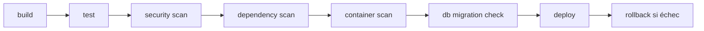

# NEXUS — Déploiement & CI/CD

Version : 1.0 (Phase 0) · Articles 47, 5 (CI/CD), 75-76

---

## 1. Modes de déploiement (article 47)

| Mode | Cible | Caractéristiques |
|---|---|---|
| **SaaS** | majorité des clients | hébergé sur Azure, multi-tenant, opéré par NEXUS |
| **Private Cloud** | grandes entreprises | déploiement dédié isolé (souscription/tenant Azure du client) |
| **On-Premises / Hybrid** | gouvernement, santé, infra sensible | données dans le périmètre client, portable via Docker |

L'architecture est **portable** : tout tourne en conteneurs, les dépendances externes (LLM, storage) sont abstraites derrière des ports (`Nexus.Application`).

---

## 2. Cible Azure (SaaS)

| Composant | Service Azure |
|---|---|
| API / modules | Azure Container Apps (ou App Service) |
| Traitements asynchrones | Azure Functions / Container Apps jobs |
| Messagerie (futur) | Azure Service Bus |
| PostgreSQL | Azure Database for PostgreSQL (flexible server, extension `vector`) |
| Neo4j | Neo4j AuraDB **ou** conteneur managé (Container Apps / AKS) |
| Storage | Azure Blob Storage |
| Secrets | Azure Key Vault (+ managed identities) |
| Identité | Microsoft Entra ID |
| IA | Azure OpenAI |
| Observabilité | Azure Monitor + Application Insights |

---

## 3. Environnements (article 75)

```text
local → development → staging → production
```

- **local** : `docker compose up` + `dotnet run` ; stub auth ; Azurite.
- **development / staging / production** : Azure, secrets via Key Vault, aucune valeur sensible dans le repo.

Configuration par variables d'environnement (voir [`.env.example`](../.env.example)) et Key Vault. Jamais de secret commité (article 72).

---

## 4. Développement local (article 76)

```bash
cp .env.example .env
docker compose up -d          # PostgreSQL+pgvector, Neo4j+GDS, Azurite
cd backend && dotnet build
dotnet run --project src/Nexus.Api
```

Objectif : un développeur clone le repo et obtient un NEXUS fonctionnel en quelques minutes.

---

## 5. Pipeline CI/CD — Azure DevOps (article 5)

Étapes du pipeline :



| Étape | Détail |
|---|---|
| **build** | `dotnet build` (warnings surveillés) + build frontend |
| **test** | unit + integration (PostgreSQL/Neo4j via conteneurs) + e2e |
| **security scan** | SAST, secrets scanning |
| **dependency scan** | NuGet/npm vulnérabilités (Dependabot/Renovate) |
| **container scan** | scan des images |
| **migration** | validation des migrations EF Core / contraintes Neo4j |
| **deploy** | déploiement Container Apps (bleu/vert quand pertinent) |
| **rollback** | retour à la version précédente en cas d'échec de santé |

---

## 6. Observabilité en production (article 44)

- **OpenTelemetry** (traces distribuées) → Application Insights.
- **Serilog** (logs structurés).
- Métriques clés : latence API (p95 < 500 ms), latence requêtes graphe (< 1-2 s), durée import, échecs connecteurs, latence & tokens IA, durée simulation, profondeur de file.

---

## 7. Objectifs de performance (article 66)

- API p95 < **500 ms** (requêtes classiques).
- Requêtes graphe < **1-2 s** (analyses normales).
- Import **asynchrone** ; simulation asynchrone si complexe.
- Caching là où pertinent (résultats de risque, embeddings, réponses IA répétitives — articles 68-69).
