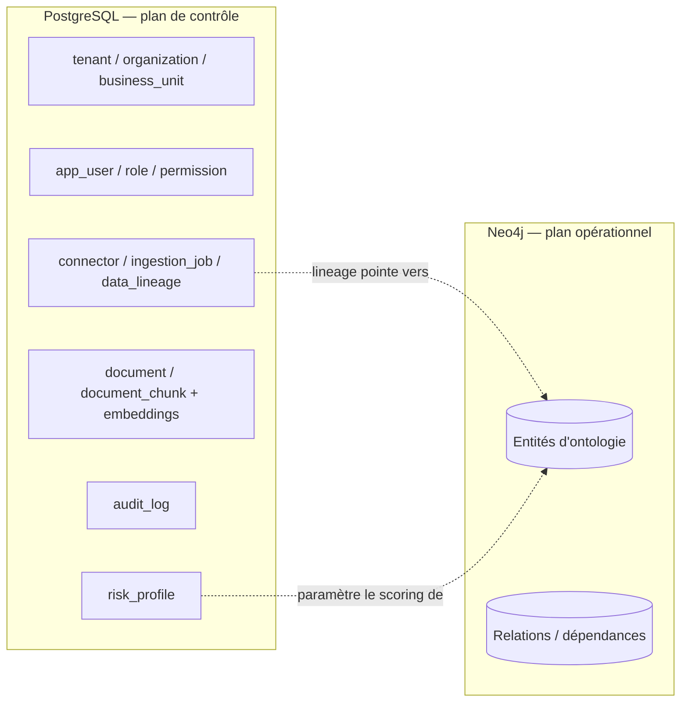
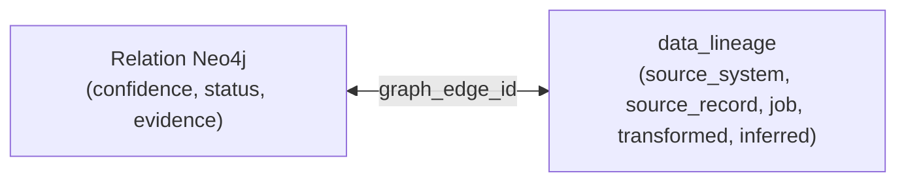

# NEXUS — Modèle de données

Version : 1.0 (Phase 0)

NEXUS répartit ses données sur **deux moteurs de stockage** complémentaires. Ce document décrit le modèle initial. Le schéma PostgreSQL est produit par les migrations EF Core (`Nexus.Infrastructure/Persistence/Migrations`) ; une version SQL **de référence** est dans [`database/postgres/reference/`](../database/postgres/reference), les extensions auto-exécutées dans [`database/postgres/init/`](../database/postgres/init), les contraintes Neo4j dans [`database/neo4j/`](../database/neo4j).

---

## 1. Répartition des responsabilités



| | PostgreSQL | Neo4j |
|---|---|---|
| Nature | relationnel, transactionnel | graphe |
| Sert à | qui / quoi / config / preuve | *dépend de quoi* / propagation |
| Volumétrie | modérée | jusqu'à 1M+ noeuds (article 67) |

Le lien entre les deux : `data_lineage.graph_node_id` / `graph_edge_id` référencent les `id` (UUID) des noeuds et relations Neo4j. Les UUID sont **générés par NEXUS** (jamais par la source), ce qui garantit la stabilité inter-bases.

---

## 2. PostgreSQL — entités principales

| Table | Rôle | Réf. article |
|---|---|---|
| `tenant` | isolation multi-tenant, mode de déploiement | 41, 47 |
| `organization`, `business_unit` | structure de l'organisation observée | 7 |
| `app_user` | utilisateurs (liés à Entra ID via `external_id`) | 41 |
| `role`, `permission`, `role_permission`, `user_role` | RBAC granulaire | 42 |
| `connector` | connecteurs configurés (read-only par défaut) | 3, 10 |
| `ingestion_job` | exécutions d'ingestion (full/incremental) | 10 |
| `data_lineage` | provenance de chaque donnée du graphe | 12 |
| `document`, `document_chunk` | documents + chunks vectorisés (pgvector) | 21 |
| `audit_log` | journal d'audit immuable | 43 |
| `risk_profile` | pondérations & seuils du Risk Engine (configurable) | 14, 15 |

**Conventions** : `snake_case`, PK `UUID` (`gen_random_uuid()`), timestamps `TIMESTAMPTZ`, isolation via colonne `tenant_id` + (à terme) Row-Level Security PostgreSQL.

---

## 3. Neo4j — modèle de graphe

- Chaque noeud : label `:Entity` + label de type (`:Server`, `:Application`…), propriétés communes de l'ontologie (voir [ONTOLOGY.md](ONTOLOGY.md) §4).
- Chaque relation : type d'ontologie (`DEPENDS_ON`…) + propriétés de relation (confiance, statut, source, preuve — §5).
- Contraintes : unicité de `Entity.id`, index sur `tenantId`, `entityType`, `name`, full-text pour l'entity resolution.

Exemple (Cypher) :

```cypher
// Un serveur SPOF qui héberge un ERP critique
CREATE (s:Entity:Server  {id:'…', tenantId:'…', entityType:'Server',
        name:'SQL01', criticality:92})
CREATE (a:Entity:Application {id:'…', tenantId:'…', entityType:'Application',
        name:'ERP', criticality:88})
CREATE (a)-[:DEPENDS_ON {id:'…', tenantId:'…', type:'DEPENDS_ON',
        confidence:0.98, status:'VERIFIED', sourceSystem:'Azure CMDB'}]->(s);
```

---

## 4. Confiance & lineage (le « pourquoi »)

NEXUS doit toujours pouvoir répondre : *« Pourquoi penses-tu que ces deux systèmes sont liés ? »* (article 12).



La réponse combine : le `status`/`confidence` de la relation + l'entrée `data_lineage` correspondante (connecteur, job, enregistrement source, transformations).

---

## 5. Migrations & seed

- Le schéma PostgreSQL est **géré exclusivement par EF Core Migrations** dans `Nexus.Infrastructure` (autorité unique). Le SQL de `database/postgres/reference/02_schema.reference.sql` sert de **référence lisible uniquement** (non exécuté). Seul `database/postgres/init/01_extensions.sql` est auto-exécuté par le conteneur (extensions), et les migrations recréent aussi ces extensions (idempotent).
- Les contraintes Neo4j sont appliquées au démarrage par `Nexus.Graph` (idempotent, `IF NOT EXISTS`).
- `Nexus.Seed` générera le dataset de démonstration (article 52-53) — voir [BACKLOG.md](BACKLOG.md).

---

## 6. Évolution prévue

- **Graphe temporel** (article 25) : exploitation de `validFrom`/`validUntil` pour l'historique et le *Change Intelligence*.
- **Row-Level Security** PostgreSQL pour durcir l'isolation tenant.
- **Index HNSW** pgvector activé après la première ingestion documentaire pour la performance ANN.
